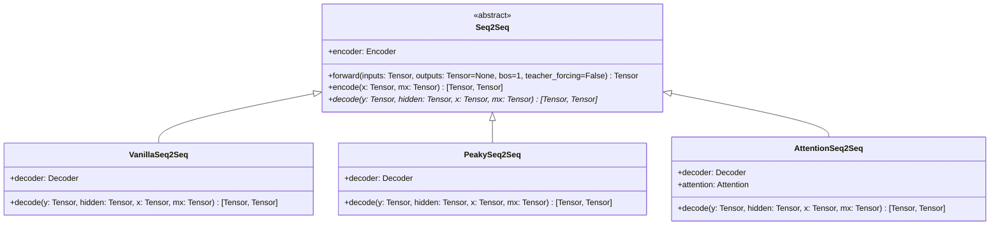

# Seq2Seq

实现了三个 Seq2Seq 法译英翻译器模型。

- 模型定义：[model.py](./model.py)
- 模型训练：[main.ipynb](./main.ipynb)

## 代码架构

Seq2Seq 作为抽象父类统一实现了 GRU 变长序列数据编码逻辑，并实现了自回归解码流程，具体解码逻辑分别由三个子类 VanillaSeq2Seq, PeakySeq2Seq, AttentionSeq2Seq 实现。



## 模型架构

### VanillaSeq2Seq

```python
VanillaSeq2Seq(
  (encoder): GRU(128, 128, batch_first=True)
  (emi): Embedding(1540, 128, padding_idx=0)
  (emo): Embedding(1218, 128, padding_idx=0)
  (lin): Linear(in_features=128, out_features=1218, bias=True)
  (out): Dropout(p=0.1, inplace=False)
  (decoder): GRU(128, 128, batch_first=True)
)
```

### PeakySeq2Seq

```python
PeakySeq2Seq(
  (encoder): GRU(128, 128, batch_first=True)
  (emi): Embedding(1540, 128, padding_idx=0)
  (emo): Embedding(1218, 128, padding_idx=0)
  (lin): Linear(in_features=128, out_features=1218, bias=True)
  (out): Dropout(p=0.1, inplace=False)
  (decoder): GRU(256, 128, batch_first=True)
)
```

### AttentionSeq2Seq

```python
AttentionSeq2Seq(
  (encoder): GRU(128, 128, batch_first=True)
  (emi): Embedding(1540, 128, padding_idx=0)
  (emo): Embedding(1218, 128, padding_idx=0)
  (lin): Linear(in_features=128, out_features=1218, bias=True)
  (out): Dropout(p=0.1, inplace=False)
  (decoder): GRU(256, 128, batch_first=True)
  (attention): Attention(
    (wa): Linear(in_features=128, out_features=128, bias=True)
    (ua): Linear(in_features=128, out_features=128, bias=True)
    (va): Linear(in_features=128, out_features=1, bias=True)
  )
)
```
